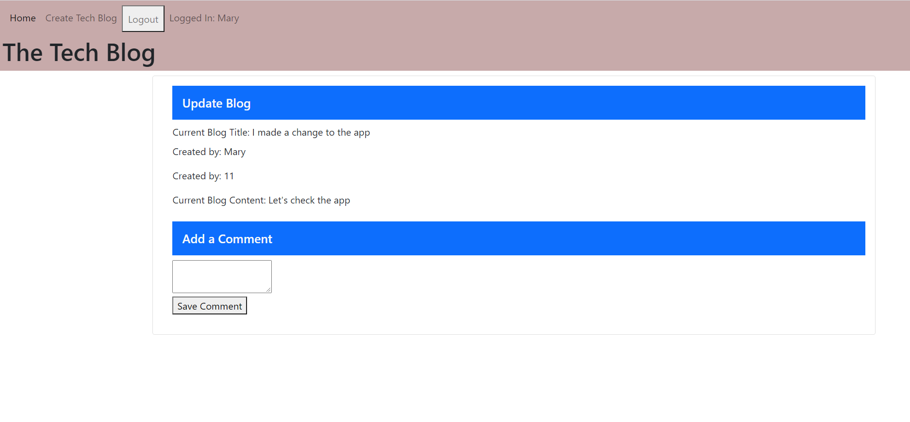

## Title: 14_Tech_Block_TS

## Table of Contents
- [Description](#description)
- [Badges](#badges)
- [License](#license)
- [Installation](#installation)
- [Usage](#usage)
- [Contributing](#contributing)
- [Tests](#tests)
- [Questions](#questions)
- [Coding requriements](#languages)
- [Github reference](#github)

## Description
🔍 The task was to build a CMS-style blog site similar to a Wordpress site, where developers can publish their blog posts and comment on other developers’ posts as well. 

## Badges
🆠;

## License
No copyright (c) applied. Changes to this code do not require the approval of the owner. No liabilitiesa are inherrited.

## Installation
💾 npm install to download all the dependencies in node. Deploy files to webserver such as Heroku for live app usage. 

## Usage
💻 This app is designed to take notes and apply comments to such.

## Contributing
👪 Many thanks to Tom McCarthy who helped me understanding the requirements and coding challanges for this api and resolving issues I faced.

## Tests
✏️ Tests were completed in conjunction with the development. 

## Questions
If you should have comments or suggestions for improvement, please send them to thomasschmidt2021@u.northwestern.edu.

## Coding requirements
HTML 5.0, CSS, JavaScript, json, Bootstrap, npm package, node.js

## Github reference 
https://github.com/Thomas-NW/14_Tech_Block_TS.git

Thank you for visiting and reviewing the project. 
---
